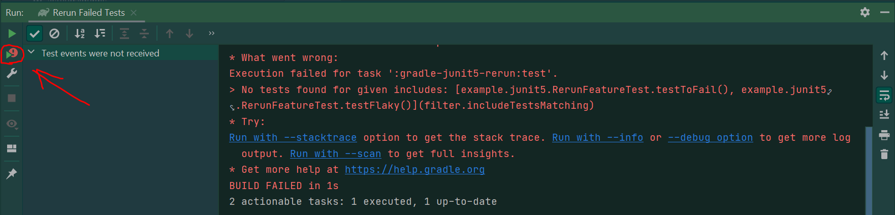

# Rerun Failed Tests

Rerun Failed Tests feature of Junit plugin for Intellij Idea doesn't work with JUnit5 tests


Steps to reproduce:
1. Run tests with Idea for the class 
   [RerunFeatureTest.java](gradle-junit5-rerun/src/test/java/example/junit5/RerunFeatureTest.java)
2. Click `Rerun Failed Tests` as shown on the screenshot

Actual result 
the error message:
`No tests found for given includes: [example.junit5.RerunFeatureTest.testToFail(), 
example.junit5.RerunFeatureTest.testFlaky()](filter.includeTestsMatching)`

The plugin tries to find the failed test methods specifying the method name with brackets,
e.g. `example.junit5.RerunFeatureTest.testToFail()`

When you try to reproduce this configuration with gradle you see that without brackets it's working

```groovy
test {
    filter {
        //Here is how it will work with gradle
        includeTestsMatching("example.junit5.RerunFeatureTest.testToFail")
    }
    useJUnitPlatform()
    testLogging {
        events "passed", "skipped", "failed"
    }
}
```

Please check the JUnit4 module and see that the same issue is not reproduced there.
